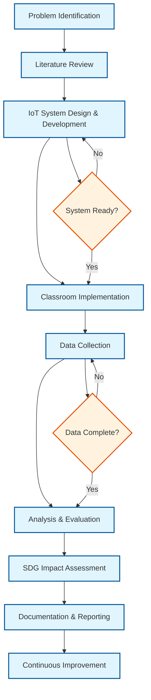
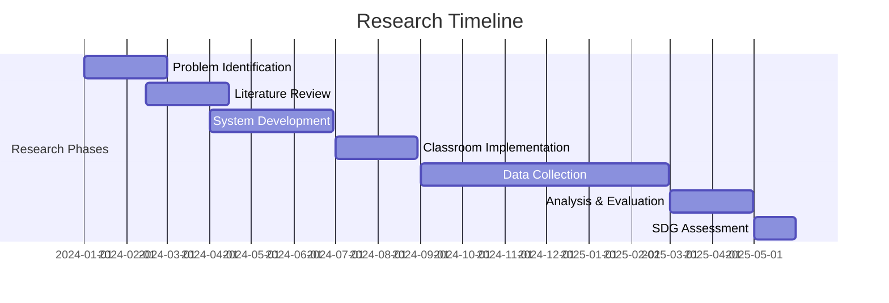

# Research Methodology: IoT-Enhanced STEM Education

## 📋 Research Flow Overview

This document outlines the comprehensive research methodology for developing and evaluating an IoT-enhanced STEM education system. The research follows a systematic approach from problem identification to evaluation against Sustainable Development Goals (SDGs).

## 🔄 Research Methodology Flowchart

## 📊 Timeline Overview

---

## 🔍 Phase 1: Problem Identification

### Objectives
- Identify gaps in current STEM education methodologies
- Understand challenges in hands-on learning environments
- Define specific problems that IoT technology can address

### Activities
- [ ] **Stakeholder Analysis**: Interview teachers, students, and administrators
- [ ] **Current State Assessment**: Evaluate existing STEM curriculum and tools
- [ ] **Problem Statement Formulation**: Define clear, measurable research questions
- [ ] **Scope Definition**: Establish boundaries and constraints of the research

### Deliverables
- Problem statement document
- Stakeholder requirements analysis
- Research questions and hypotheses

---

## 📚 Phase 2: Literature Review

### Objectives
- Understand current state of IoT in education
- Identify best practices and existing solutions
- Establish theoretical framework for the research

### Research Areas
- [ ] **IoT in Education**: Current implementations and case studies
- [ ] **STEM Education**: Modern pedagogical approaches and challenges
- [ ] **Educational Technology**: Impact of technology on learning outcomes
- [ ] **Sensor Networks**: Technical requirements and limitations
- [ ] **Data Analytics**: Methods for analyzing educational data

### Deliverables
- Comprehensive literature review document
- Theoretical framework
- Technology gap analysis
- Research methodology justification

---

## 🔧 Phase 3: IoT System Design & Prototype Development

### Objectives
- Design IoT system architecture for STEM education
- Develop functional prototype with sensors and data collection
- Ensure scalability and reliability of the system

### Technical Components
- [ ] **Hardware Design**:
  - Sensor selection (temperature, humidity, light, motion, etc.)
  - Microcontroller/development board selection
  - Communication protocols (WiFi, Bluetooth, LoRa)
  - Power management and battery life optimization

- [ ] **Software Development**:
  - Firmware for sensor nodes
  - Data collection and transmission protocols
  - Backend API for data processing
  - Real-time data visualization dashboard

- [ ] **System Architecture**:
  - Cloud infrastructure setup
  - Database design for sensor data
  - Security and privacy considerations
  - Scalability planning

### Deliverables
- System architecture document
- Functional prototype
- Technical specifications
- Testing and validation results

---

## 🏫 Phase 4: Implementation in STEM Classroom

### Objectives
- Deploy IoT system in real educational environment
- Integrate with existing STEM curriculum
- Train educators on system usage

### Implementation Strategy
- [ ] **Pilot Program Setup**:
  - Select appropriate classroom/school
  - Install and configure IoT sensors
  - Train teachers and technical staff
  - Establish baseline measurements

- [ ] **Curriculum Integration**:
  - Develop lesson plans incorporating IoT data
  - Create hands-on activities using sensor data
  - Design student projects and experiments
  - Align with educational standards

- [ ] **User Training**:
  - Teacher training workshops
  - Student orientation sessions
  - Technical support documentation
  - Troubleshooting guides

### Deliverables
- Implementation plan and timeline
- Training materials and documentation
- Deployed IoT system in classroom
- Initial user feedback and observations

---

## 📊 Phase 5: Data Collection (Sensors + Surveys)

### Objectives
- Collect comprehensive data on system performance
- Gather user experience and learning outcome data
- Ensure data quality and reliability

### Data Collection Methods
- [ ] **Sensor Data**:
  - Environmental measurements (temperature, humidity, light, air quality)
  - System performance metrics (uptime, data accuracy, response time)
  - Usage patterns and interaction logs
  - Technical performance indicators

- [ ] **Educational Data**:
  - Pre and post-assessment scores
  - Student engagement metrics
  - Learning outcome measurements
  - Skill development tracking

- [ ] **User Experience Data**:
  - Teacher surveys and interviews
  - Student feedback and questionnaires
  - Usability testing results
  - System adoption and usage statistics

### Data Management
- [ ] **Data Storage**: Secure cloud database with backup systems
- [ ] **Data Privacy**: Compliance with educational data protection regulations
- [ ] **Data Quality**: Validation and cleaning procedures
- [ ] **Data Access**: Controlled access for research team

### Deliverables
- Comprehensive dataset
- Data collection protocols
- Data quality assessment report
- Privacy and security documentation

---

## 📈 Phase 6: Analysis of Technical & Educational Outcomes

### Objectives
- Analyze system performance and reliability
- Evaluate educational impact and learning outcomes
- Identify correlations between IoT usage and student performance

### Analysis Framework
- [ ] **Technical Analysis**:
  - System reliability and uptime statistics
  - Data accuracy and sensor performance
  - Network performance and communication efficiency
  - Scalability and resource utilization

- [ ] **Educational Analysis**:
  - Learning outcome improvements
  - Student engagement and motivation
  - Teacher satisfaction and adoption rates
  - Curriculum integration effectiveness

- [ ] **Statistical Analysis**:
  - Descriptive statistics for all metrics
  - Correlation analysis between variables
  - Comparative analysis (before/after implementation)
  - Regression analysis for predictive insights

### Tools and Methods
- [ ] **Data Visualization**: Charts, graphs, and dashboards
- [ ] **Statistical Software**: R, Python, or SPSS for analysis
- [ ] **Machine Learning**: Pattern recognition and predictive modeling
- [ ] **Qualitative Analysis**: Thematic analysis of interviews and feedback

### Deliverables
- Technical performance analysis report
- Educational impact assessment
- Statistical analysis results
- Data visualization dashboards

---

## 🌍 Phase 7: Evaluation and Link to SDGs (2, 4, 11)

### Objectives
- Evaluate project contribution to Sustainable Development Goals
- Assess long-term sustainability and scalability
- Provide recommendations for broader implementation

### SDG Alignment Analysis
- [ ] **SDG 2: Zero Hunger**
  - Connection to agricultural IoT applications
  - Food security education through sensor data
  - Sustainable farming practices in curriculum

- [ ] **SDG 4: Quality Education**
  - Improved access to technology-enhanced learning
  - Enhanced STEM education quality
  - Digital literacy development
  - Inclusive education practices

- [ ] **SDG 11: Sustainable Cities and Communities**
  - Smart city concepts in education
  - Environmental monitoring and awareness
  - Community engagement through IoT projects
  - Sustainable development education

### Evaluation Metrics
- [ ] **Impact Assessment**:
  - Number of students reached
  - Learning outcome improvements
  - Teacher professional development
  - Community engagement levels

- [ ] **Sustainability Indicators**:
  - System maintenance requirements
  - Cost-effectiveness analysis
  - Environmental impact assessment
  - Long-term viability planning

### Deliverables
- SDG contribution analysis report
- Sustainability assessment
- Implementation recommendations
- Policy implications document

---

## 📅 Timeline and Milestones

| Phase | Duration | Key Milestones |
|-------|----------|----------------|
| 1. Problem Identification | 2-3 months | Problem statement, stakeholder analysis |
| 2. Literature Review | 2-3 months | Literature review document, framework |
| 3. System Design & Development | 4-6 months | Functional prototype, technical specs |
| 4. Classroom Implementation | 3-4 months | Deployed system, training completed |
| 5. Data Collection | 6-12 months | Comprehensive dataset, quality assessment |
| 6. Analysis | 2-3 months | Analysis reports, visualizations |
| 7. SDG Evaluation | 1-2 months | Final report, recommendations |

---

## 🎯 Expected Outcomes

### Technical Outcomes
- Functional IoT system for STEM education
- Scalable architecture for broader deployment
- Technical documentation and best practices

### Educational Outcomes
- Improved student engagement and learning outcomes
- Enhanced teacher capabilities and confidence
- Validated curriculum integration approach

### Research Outcomes
- Peer-reviewed publications
- Conference presentations
- Policy recommendations
- Open-source tools and resources

### Societal Impact
- Contribution to SDG targets
- Enhanced STEM education accessibility
- Community awareness of IoT and sustainability

---

## 📝 Documentation and Reporting

### Regular Reporting
- [ ] Monthly progress reports
- [ ] Quarterly milestone assessments
- [ ] Annual comprehensive reviews

### Final Deliverables
- [ ] Complete research report
- [ ] Technical documentation
- [ ] Educational resources and materials
- [ ] Policy recommendations
- [ ] Open-source code and tools

---

## 🔄 Continuous Improvement

### Feedback Loops
- Regular stakeholder feedback collection
- System performance monitoring
- Educational outcome tracking
- User experience evaluation

### Iterative Development
- System improvements based on feedback
- Curriculum refinements
- Technology updates and upgrades
- Best practice documentation

---

*This research methodology provides a comprehensive framework for developing and evaluating IoT-enhanced STEM education systems while contributing to global sustainability goals.*
